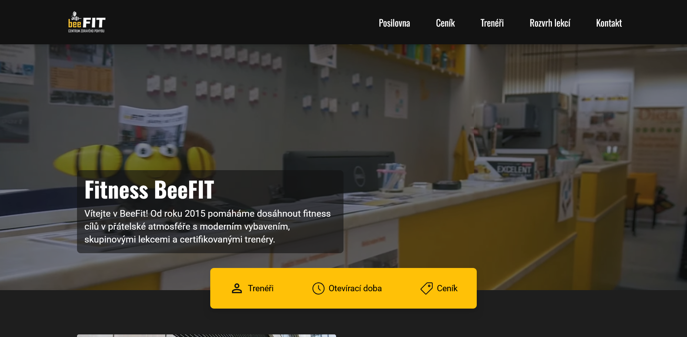

# BeeFIT – Fitness Website Project

A production-ready fitness center website built with modern web technologies for a Prague-based client. This full-year collaboration project showcases the complete web development lifecycle — from client meetings and design to development, deployment, and ongoing content management.

**🎓 Created as a high school graduation project**

## Key Features

- **Modern Tech Stack**: SvelteKit 2 with Svelte 5 (latest runes API)
- **Headless CMS**: Sanity.io integration for easy content management
- **SEO Optimized**: Meta tags, structured data, sitemap, and robots.txt
- **Fully Responsive**: Mobile-first design with optimized media queries
- **Performance**: WebP images, lazy loading, and optimized bundle sizes
- **Accessibility**: WCAG compliant, tested with Lighthouse and WAVE
- **Security**: CSP headers, HTTPS, and secure content delivery

## Table of contents

- [Overview](#overview)
  - [The challenge](#the-challenge)
  - [Screenshot](#screenshot)
  - [Links](#links)
- [My process](#my-process)
  - [Built with](#built-with)
  - [What I learned](#what-i-learned)
  - [Continued development](#continued-development)
  - [Useful resources](#useful-resources)
- [Author](#author)
- [Acknowledgments](#acknowledgments)

## Overview

### The challenge

The main challenge was to create a **modern and maintainable website** for a real client, while ensuring:

- Responsive design across devices
- SEO optimization and performance improvements
- Accessibility support
- A custom CMS for the client to easily manage content
- Deployment on the client’s hosting

### Screenshot



### Links

- Repository: [GitHub Repo](https://github.com/lxkask/beefit)  
- Live Preview (Netlify): [tubular-stardust-fbff63.netlify.app](https://tubular-stardust-fbff63.netlify.app/)  
- Test Domain: [fit-fat.cz](http://fit-fat.cz/)  

## My process

### Built with

**Frontend:**
- [SvelteKit 2](https://kit.svelte.dev/) – Full-stack Svelte framework with SSG
- [Svelte 5](https://svelte.dev/) – Using modern runes API ($state, $derived, $effect)
- [TailwindCSS](https://tailwindcss.com/) – Utility-first CSS with custom design tokens
- [Melt UI](https://melt-ui.com/) – Headless, accessible UI components

**Backend & CMS:**
- [Sanity.io](https://www.sanity.io/) – Headless CMS for content management
- [picosanity](https://github.com/rexxars/picosanity) – Lightweight Sanity client for browser

**Build & Deployment:**
- [Vite](https://vitejs.dev/) – Fast build tool with optimized bundling
- [adapter-static](https://kit.svelte.dev/docs/adapter-static) – Static site generation
- [Netlify](https://www.netlify.com/) – Preview deployments
- [Český hosting](https://www.cesky-hosting.cz/) – Production hosting with Apache

**Quality & Testing:**
- Lighthouse – Performance, SEO, and best practices audits
- WAVE – Web accessibility evaluation
- TypeScript – Type safety across the codebase

### What I learned

**Technical Skills:**
- Migrating to **Svelte 5 runes** ($state, $derived, $effect) from traditional Svelte syntax
- Integrating **headless CMS** (Sanity) with client-side data fetching
- Implementing **CSP (Content Security Policy)** headers for security
- Optimizing for **static site generation** while maintaining dynamic content
- Browser-compatible API clients (picosanity vs @sanity/client)

**Web Development Best Practices:**
- SEO optimization (meta tags, Open Graph, structured data, sitemaps)
- Accessibility standards (WCAG compliance, semantic HTML, ARIA labels)
- Performance optimization (WebP images, lazy loading, code splitting)
- Responsive design with mobile-first approach
- Apache .htaccess configuration for SPAs

**Project Management:**
- Long-term client collaboration and iterative feedback cycles
- Version control with feature branches
- Production deployment workflow
- Debugging production issues (CSP, SSR vs client-side rendering)  

## Development Setup

### Prerequisites
- Node.js 18+ and npm
- Git

### Installation

1. Clone the repository:
```bash
git clone https://github.com/lxkask/beefit.git
cd beefit
```

2. Install dependencies:
```bash
npm install
```

3. Set up environment variables:
```bash
cp .env.example .env
```
Add your Sanity project credentials to `.env`

4. Start development server:
```bash
npm run dev
```

### Available Scripts

- `npm run dev` – Start development server (default: http://localhost:5173)
- `npm run build` – Build for production (outputs to `/build`)
- `npm run preview` – Preview production build locally
- `npm run check` – Run TypeScript and Svelte checks
- `npm run lint` – Lint code with Prettier and ESLint
- `npm run format` – Format code with Prettier

### Sanity CMS Setup

The Sanity backend is located in the `sanity-backend/` directory:

```bash
cd sanity-backend
npm install
npm run dev  # Starts Sanity Studio on http://localhost:3333
```

Content schemas are defined in `sanity-backend/schemaTypes/`

### Project Structure

```
beefit/
├── src/
│   ├── routes/              # SvelteKit pages (file-based routing)
│   │   ├── +page.svelte     # Homepage
│   │   ├── cenik/           # Pricing page
│   │   ├── posilovna/       # Gym gallery page
│   │   ├── treneri/         # Trainers page
│   │   ├── rozvrh/          # Schedule page
│   │   └── kontakt/         # Contact page
│   ├── lib/
│   │   ├── components/      # Reusable Svelte components
│   │   ├── sanityClient.ts  # Sanity API client config
│   │   ├── types/           # TypeScript definitions
│   │   ├── images/          # Static images
│   │   └── videos/          # Static videos
│   ├── app.html             # HTML template
│   └── app.css              # Global styles
├── sanity-backend/          # Sanity CMS configuration
│   └── schemaTypes/         # Content models
├── static/                  # Static assets (robots.txt, sitemap.xml)
├── .htaccess               # Apache configuration (CSP, routing)
└── svelte.config.js        # SvelteKit configuration
```

### Continued development

Future improvements:
- Enhanced CMS flexibility for content editors
- Performance optimizations and better caching strategies
- Animations with respect to reduced motion preferences
- Integration with booking/reservation systems  

### Useful resources

- [Svelte Documentation](https://svelte.dev/docs) – for mastering component-based development  
- [TailwindCSS Docs](https://tailwindcss.com/docs) – for rapid styling workflow  
- [Sanity.io Docs](https://www.sanity.io/docs) – helped with the CMS setup  

## Author

- GitHub – [@lxkask](https://github.com/lxkask)  
- Instagram – [@l.xkas](https://www.instagram.com/l.xkas/)  
- LinkedIn – [Lukáš Kubík](https://www.linkedin.com/in/luk%C3%A1%C5%A1-kub%C3%ADk-251605245/)  

## Acknowledgments

A big thank you to my classmate for collaborating on this project, and to our client for the valuable feedback throughout the development process.  
This project was also supervised as part of our high school graduation requirements. 